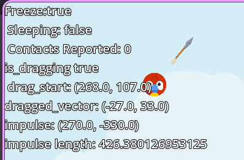

# Aprendido en Angry Animals

## Mecánica de Arrastre ("Drag")
Cómo configurar la mecánica de lanzamiento, similar a la de Angry Birds.

La idea principal se basa en:
1. **Detección de Click:** Mientras el objeto esté siendo clickeado, se puede arrastrar dentro de una zona delimitada.
2. **Aplicación de Fuerza:** Al soltar el click, se le aplica una fuerza de impulso al `RigidBody2D`. Esta fuerza se aplica usando el vector opuesto al que se estaba arrastrando.

### Escala de la Flecha
Para dar feedback visual al jugador, se implementa una flecha que aparece al arrastrar. La escala (tamaño) de esta flecha aumenta dependiendo de qué tanto arrastres, controlando su tamaño máximo y mínimo mediante funciones matemáticas:
- **`clamp`:** Esta función sirve para limitar un valor entre un mínimo y un máximo (los "extremos"). Esto asegura que la flecha no se haga infinitamente grande ni desaparezca por completo.
- **`lerp` (Linear Interpolation):** Esta función sirve para encontrar un valor intermedio entre dos puntos, basándose en un "peso" o porcentaje (`t`). En este caso, nos permite hacer que la transición de la escala de la flecha sea mucho más suave mientras calculamos el nuevo tamaño.

## Propiedades del RigidBody2D
Aprendí bastante sobre cómo funcionan los `RigidBody2D` y las propiedades que se pueden ajustar en el Inspector:
- **Physics Material (Bounce):** Se puede añadir un material físico para definir propiedades como el rebote.
- **Freeze:** Permite "congelar" el objeto en el espacio temporalmente para que no le afecte la gravedad hasta que lo decidamos.
- **Pickable:** Es crucial activar esta opción en el Inspector para que el `RigidBody` pueda detectar eventos de entrada del mouse (como los clicks para arrastrar).

## Debugging en Tiempo Real
Aprendí a colocar un `Label` específico para el Debug. Como se ve en la imagen, este Label nos muestra información valiosa en tiempo real sobre nuestro `RigidBody2D`, como si está congelado, el vector de arrastre, el impulso calculado y la longitud del impulso. Esto facilita enormemente entender qué está sucediendo "por debajo" con la física.
